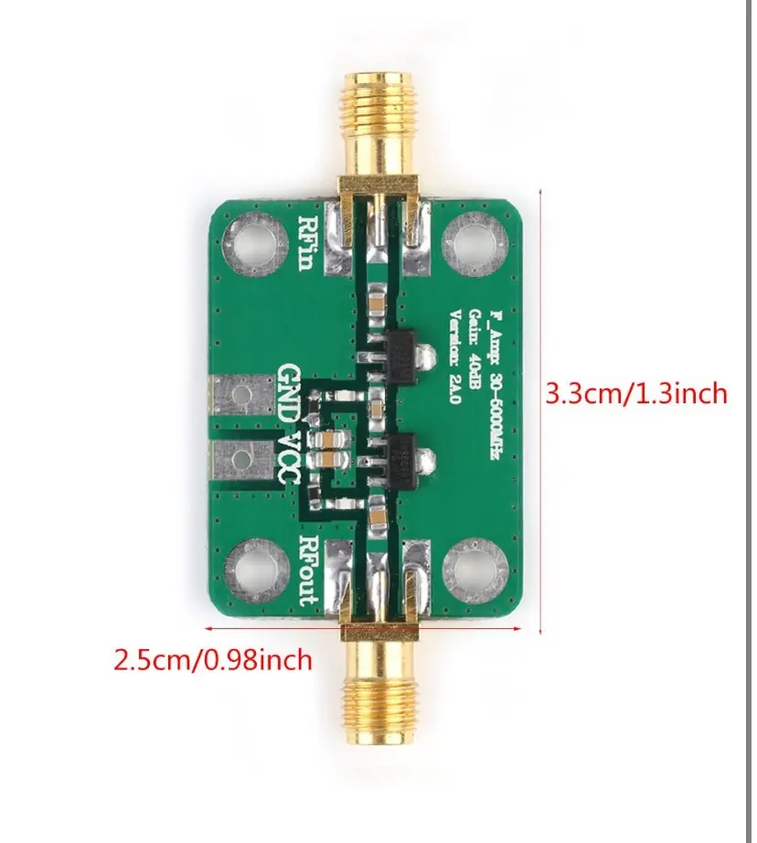

# 📡 XBee Integration Plan - Communication Switching System

## Executive Summary

This document outlines the plan to integrate **XBee Pro 900HP** as a fourth communication method into the existing N4 Base Station, alongside WiFi/MQTT and Beacon modes.

**Current System:** 2 communication modes (MQTT + Beacon)  
**Target System:** 3 communication modes (MQTT + Beacon + XBee)

---

## 📊 Current Communication Architecture

### Existing Modes

#### 1. **MQTT Mode** (WiFi-based)
- **Path:** Rocket ESP32 → WiFi → MQTT Broker → Base Station Server → Dashboard
- **Protocol:** MQTT over WiFi
- **Advantages:** Long range with WiFi infrastructure, bidirectional commands
- **Disadvantages:** Requires WiFi network, power-hungry

#### 2. **Beacon Mode** (ESP-NOW)
- **Path:** Rocket ESP32 → ESP-NOW Beacon → Base Station ESP32 → Serial → Server → Dashboard
- **Protocol:** ESP-NOW broadcast beacons (802.11 management frames)
- **Advantages:** No infrastructure needed, low power
- **Disadvantages:** Limited range (~200m), one-way telemetry only



*Rocket-side beacon hardware: ESP32 with 2.4 GHz duck antenna and inline signal amplifier used for the ESP-NOW broadcast beacon link.*

#### 3. **Auto Fallback**
- Automatically switches between MQTT and Beacon based on connectivity
- Monitors packet age and connection health

---

## 🔄 Communication Switching Implementation

### 1. **Arduino Base Station** (`Basestation_Code_6_Bluetooth.ino`)

**Current Commands:**
```cpp
// Mode switching commands
CMD_MQTT_MODE        // Switch to MQTT mode
CMD_BEACON_MODE      // Switch to Beacon mode
CMD_AUTO_FALLBACK_ON  // Enable automatic fallback
CMD_AUTO_FALLBACK_OFF // Disable automatic fallback
```

**Command Processing:** (Lines 337-374)
```cpp
void processCommand(String command) {
  command.toUpperCase();

  if (command == "CMD_MQTT_MODE" || command == "MQTT_MODE" || command == "MQTT") {
    lastCommand = "CMD_MQTT_MODE";
    commandPending = true;
    commandSentTime = millis();
    sendLogMessage("INFO", "Command: Switch to MQTT mode", "BaseStation");
  }
  else if (command == "CMD_BEACON_MODE" || command == "BEACON_MODE" || command == "BEACON") {
    lastCommand = "CMD_BEACON_MODE";
    commandPending = true;
    commandSentTime = millis();
    sendLogMessage("INFO", "Command: Switch to Beacon mode", "BaseStation");
  }
  // ... more commands
}
```

**Telemetry Output:** (Lines 181-220)
```cpp
void sendTelemetryJSON() {
  // ... build JSON document
  doc["communication_mode"] = "Beacon";  // ← Hardcoded for beacon mode
  doc["timestamp"] = millis();
  // ... send via Serial and Bluetooth
}
```

**Key Observations:**
- Commands are sent from base station to rocket via ESP-NOW
- Telemetry includes `communication_mode` field
- Mode is currently hardcoded as "Beacon" in this base station code

---

### 2. **Python Server** (`research/scripts/server.py`)

**Communication Detection:** (Lines 450-480)
```python
class ConnectionStatus:
    def get_mode(self):
        with self.lock:
            now = time.time()
            serial_active = (now - self.last_serial) < AUTO_DETECT_INTERVAL*2
            mqtt_active = (now - self.last_mqtt) < AUTO_DETECT_INTERVAL*2
            
            if serial_active and mqtt_active:
                return "DUAL"
            elif mqtt_active:
                return "MQTT"
            elif serial_active:
                return "BEACON"
            return "UNKNOWN"
```

**Telemetry Processing:**
```python
# Line 695: MQTT telemetry
data["communication_mode"] = "MQTT"

# Line 834: Serial/Beacon telemetry
data["communication_mode"] = data.get("communication_mode", "BEACON").upper()
```

**Key Observations:**
- Server automatically detects active communication mode
- Supports DUAL mode (both MQTT and Beacon active)
- `communication_mode` field is preserved from incoming telemetry
- CSV logging includes `communication_mode` as field #28

---

### 3. **React Dashboard** (`src/components/Sidebar.jsx`)

**UI Controls:** (Lines 303-327)
```jsx
<Button
  onClick={() => handleCommandClick({command: "mqtt"})}
  className={currentCommMode === "MQTT" ? "active" : "inactive"}
>
  MQTT
</Button>

<Button
  onClick={() => handleCommandClick({command: "beacon"})}
  className={currentCommMode === "Beacon" ? "active" : "inactive"}
>
  BEACON
</Button>
```

**State Management:** (Lines 114-128)
```jsx
switch(command.command) {
  case "mqtt":
    setCurrentCommMode("MQTT");
    break;
  case "beacon":
    setCurrentCommMode("Beacon");
    break;
  case "auto_on":
    setAutoFallbackEnabled(true);
    break;
  case "auto_off":
    setAutoFallbackEnabled(false);
    break;
}
```

**Communication Badge:** (Lines 238-248)
```jsx
<div className={
  props.communicationMode === "Beacon" ? "orange-badge"
  : props.communicationMode === "MQTT" ? "blue-badge"
  : "gray-badge"
}>
  {props.communicationMode}
</div>
```

**Key Observations:**
- UI has 2 toggle buttons for MQTT/Beacon
- Visual feedback with color coding (MQTT=blue, Beacon=orange)
- Auto fallback toggle (ON/OFF buttons)
- Communication mode badge displays current active mode

---

## 🆕 XBee Integration Requirements

### Hardware Configuration

**Production Setup (UART CSV Mode):**
- **Rocket Side:** ESP32 + XBee Pro 900HP (uart_csv_sender_rocket.ino)
- **Ground Side:** ESP32 + XBee Pro 900HP (uart_csv_receiver_ground.ino)
- **Baud Rate:** 115200
- **Protocol:** Transparent Mode (AP=0)
- **Data Format:** CSV strings (`timestamp,state,alt,vel,acc,batt`)
- **Update Rate:** 50Hz (20ms intervals)
- **Wiring:** 4 wires (VCC, GND, TX→GPIO32, RX→GPIO34)

**Communication Path:**
```
Rocket ESP32 (GPIO32 TX) 
    ↓ UART @ 115200 baud
XBee Sender (900MHz radio)
    ↓ Over-the-air @ 200kbps
XBee Receiver (900MHz radio)
    ↓ UART @ 115200 baud
Ground ESP32 (GPIO34 RX)
    ↓ USB Serial
Python Server
    ↓ MQTT
Dashboard
```

---

## 📝 Implementation Plan

### Phase 1: Arduino Base Station Changes

#### File: `research/arduino_code/Basestation_Code_XBee.ino`

**1.1 Add XBee UART Configuration**
```cpp
// ====== XBee Serial Configuration ======
HardwareSerial XBeeSerial(3);  // Use UART3 for XBee
#define XBEE_TX 32  // ESP32 TX to XBee RX
#define XBEE_RX 34  // ESP32 RX to XBee TX
#define XBEE_BAUD 115200

enum CommunicationMode {
  MODE_MQTT = 0,
  MODE_BEACON = 1,
  MODE_XBEE = 2,
  MODE_AUTO = 3
};

CommunicationMode currentMode = MODE_AUTO;
bool xbeeEnabled = false;
```

**1.2 Initialize XBee in setup()**
```cpp
void setup() {
  Serial.begin(115200);
  BTSerial.begin(460800, SERIAL_8N1, BT_RX, BT_TX);
  XBeeSerial.begin(XBEE_BAUD, SERIAL_8N1, XBEE_RX, XBEE_TX);  // ← NEW
  
  sendLogMessage("INFO", "XBee UART initialized @ 115200 baud", "BaseStation");
  
  // ... existing setup code
}
```

**1.3 Add XBee Telemetry Receiver**
```cpp
void handleXBeeTelemetry() {
  if (!XBeeSerial.available()) return;
  
  static String xbeeBuffer = "";
  
  while (XBeeSerial.available()) {
    char c = XBeeSerial.read();
    
    if (c == '\n') {
      // Parse CSV: timestamp,state,altitude,velocity,accel_z,battery
      if (parseXBeeCSV(xbeeBuffer)) {
        sendTelemetryJSON();  // Send to dashboard
      }
      xbeeBuffer = "";
    } else {
      xbeeBuffer += c;
    }
  }
}

bool parseXBeeCSV(const String& csv) {
  // Parse simplified 6-field format
  // timestamp,state,altitude,velocity,accel_z,battery
  int field = 0;
  int start = 0;
  
  for (int i = 0; i <= csv.length(); i++) {
    if (i == csv.length() || csv[i] == ',') {
      String value = csv.substring(start, i);
      
      switch(field) {
        case 0: telemetry.record_number = value.toInt(); break;
        case 1: telemetry.state = value.toInt(); break;
        case 2: telemetry.altitude_agl = value.toFloat(); break;
        case 3: telemetry.velocity = value.toFloat(); break;
        case 4: telemetry.az = value.toFloat(); break;
        case 5: telemetry.battery_voltage = value.toFloat(); break;
      }
      
      start = i + 1;
      field++;
    }
  }
  
  lastPacketTime = millis();
  dataReceived = true;
  packetsReceived++;
  
  return (field == 6);  // Valid if we got all 6 fields
}
```

**1.4 Update sendTelemetryJSON()**
```cpp
void sendTelemetryJSON() {
  // ... existing JSON building code
  
  // Update communication mode field
  if (currentMode == MODE_XBEE) {
    doc["communication_mode"] = "XBee";
  } else if (currentMode == MODE_BEACON) {
    doc["communication_mode"] = "Beacon";
  } else if (currentMode == MODE_MQTT) {
    doc["communication_mode"] = "MQTT";
  } else {
    doc["communication_mode"] = "Auto";
  }
  
  // ... send to Serial and Bluetooth
}
```

**1.5 Add XBee Command Processing**
```cpp
void processCommand(String command) {
  command.toUpperCase();
  
  // ... existing commands
  
  else if (command == "CMD_XBEE_MODE" || command == "XBEE_MODE" || command == "XBEE") {
    currentMode = MODE_XBEE;
    xbeeEnabled = true;
    sendLogMessage("INFO", "Command: Switch to XBee mode", "BaseStation");
  }
  else if (command == "XBEE_ON") {
    xbeeEnabled = true;
    sendLogMessage("INFO", "XBee enabled", "BaseStation");
  }
  else if (command == "XBEE_OFF") {
    xbeeEnabled = false;
    sendLogMessage("INFO", "XBee disabled", "BaseStation");
  }
}
```

**1.6 Update Main Loop**
```cpp
void loop() {
  updateConnectionStatus();
  handleSerialCommands();
  sendCommandToRocket();
  
  // Handle XBee telemetry
  if (xbeeEnabled) {
    handleXBeeTelemetry();  // ← NEW
  }
  
  // ... existing heartbeat code
}
```

---

### Phase 2: Python Server Changes

#### File: `research/scripts/server.py`

**2.1 Add XBee Serial Port Detection**
```python
def find_xbee_port():
    """Find XBee-connected ESP32 port"""
    xbee_ids = ['XBee', 'XBEE', 'ESP32', 'CP210', 'CH340']
    
    ports = list_ports.comports()
    for port in ports:
        desc = (port.description or "") + " " + (port.manufacturer or "")
        if any(id in desc for id in xbee_ids):
            try:
                # Test connection at XBee baud rate
                test_conn = serial.Serial(port.device, 115200, timeout=0.5)
                test_conn.close()
                logger.info(f"Found XBee port: {port.device}")
                return port.device
            except Exception:
                continue
    return None
```

**2.2 Update Connection Status Class**
```python
class ConnectionStatus:
    def __init__(self):
        self.lock = Lock()
        self.last_serial = 0
        self.last_mqtt = 0
        self.last_xbee = 0  # ← NEW
        self.current_mode = "UNKNOWN"
    
    def update_xbee(self):  # ← NEW
        with self.lock:
            self.last_xbee = time.time()
    
    def get_mode(self):
        with self.lock:
            now = time.time()
            serial_active = (now - self.last_serial) < AUTO_DETECT_INTERVAL*2
            mqtt_active = (now - self.last_mqtt) < AUTO_DETECT_INTERVAL*2
            xbee_active = (now - self.last_xbee) < AUTO_DETECT_INTERVAL*2  # ← NEW
            
            # Determine mode based on active connections
            active_modes = []
            if mqtt_active:
                active_modes.append("MQTT")
            if serial_active:
                active_modes.append("BEACON")
            if xbee_active:
                active_modes.append("XBEE")
            
            if len(active_modes) > 1:
                return "+".join(active_modes)  # e.g., "MQTT+XBEE"
            elif len(active_modes) == 1:
                return active_modes[0]
            return "UNKNOWN"
```

**2.3 Add XBee Telemetry Processing**
```python
def process_xbee_telemetry(line):
    """Process XBee CSV telemetry"""
    try:
        # Parse JSON from base station (which parsed XBee CSV)
        data = json.loads(line)
        
        # Ensure communication mode is set
        if data.get("communication_mode") == "XBee":
            connection_status.update_xbee()
            
            # Publish to MQTT
            publish_telemetry(data)
            
            # Log to CSV
            log_to_csv(data)
            
            logger.debug(f"XBee telemetry: alt={data.get('altitude', 'N/A')}m")
            
    except Exception as e:
        logger.error(f"XBee telemetry parse error: {e}")
```

**2.4 Update Serial Read Loop**
```python
def read_serial_data():
    """Read from serial port"""
    global serial_conn
    
    while True:
        try:
            if serial_conn and serial_conn.is_open:
                line = serial_conn.readline().decode('utf-8', errors='ignore').strip()
                
                if line.startswith('{'):
                    data = json.loads(line.split('|')[0])  # Remove device ID
                    
                    # Route based on communication mode
                    comm_mode = data.get('communication_mode', '').upper()
                    
                    if comm_mode == 'XBEE':
                        process_xbee_telemetry(line)
                    elif comm_mode == 'MQTT':
                        process_mqtt_telemetry(line)
                    elif comm_mode == 'BEACON':
                        process_beacon_telemetry(line)
                    else:
                        # Auto-detect mode
                        process_telemetry(line)
                        
        except Exception as e:
            logger.error(f"Serial read error: {e}")
            time.sleep(0.1)
```

**2.5 Update Command Handler**
```python
def send_command(cmd, source):
    """Send command to flight computer"""
    cmd = cmd.upper().strip()
    
    # Map friendly names to actual commands
    command_map = {
        'MQTT': 'CMD_MQTT_MODE',
        'BEACON': 'CMD_BEACON_MODE',
        'XBEE': 'CMD_XBEE_MODE',  # ← NEW
        'AUTO_ON': 'CMD_AUTO_FALLBACK_ON',
        'AUTO_OFF': 'CMD_AUTO_FALLBACK_OFF',
        # ... existing mappings
    }
    
    actual_cmd = command_map.get(cmd, cmd)
    
    # Send to base station via serial
    if serial_conn and serial_conn.is_open:
        serial_conn.write(f"{actual_cmd}\n".encode())
        logger.info(f"✅ Command sent: {actual_cmd} (from {source})")
    else:
        logger.warning(f"⚠️ Cannot send command - no serial connection")
```

---

### Phase 3: React Dashboard Changes

#### File: `src/components/Sidebar.jsx`

**3.1 Add XBee Button UI**
```jsx
{/* Communication Mode Control */}
<div className="min-h-14 w-full p-2 rounded-2xl flex flex-col items-center justify-center font-semibold transition duration-300 ease-in-out border-2 border-gray-800 relative">
  <div className="text-sm uppercase -mt-6 bg-white px-1 z-10 h-1/3">
    Communication Mode
  </div>
  <div className="text-base h-2/3 w-full pt-1 uppercase items-center text-center grid grid-cols-3 gap-2">
    {/* MQTT Button */}
    <Button
      onClick={() => handleCommandClick({command: "mqtt"})}
      className={`px-1 py-1 rounded-full shadow-md border-2 ${
        currentCommMode === "MQTT" 
          ? "bg-green-600 text-white border-green-800" 
          : "bg-gray-400 text-white border-gray-600"
      }`}
    >
      MQTT
    </Button>
    
    {/* Beacon Button */}
    <Button
      onClick={() => handleCommandClick({command: "beacon"})}
      className={`px-1 py-1 rounded-full shadow-md border-2 ${
        currentCommMode === "Beacon" 
          ? "bg-orange-600 text-white border-orange-800" 
          : "bg-gray-400 text-white border-gray-600"
      }`}
    >
      BEACON
    </Button>
    
    {/* XBee Button - NEW */}
    <Button
      onClick={() => handleCommandClick({command: "xbee"})}
      className={`px-1 py-1 rounded-full shadow-md border-2 ${
        currentCommMode === "XBee" 
          ? "bg-purple-600 text-white border-purple-800" 
          : "bg-gray-400 text-white border-gray-600"
      }`}
    >
      XBEE
    </Button>
  </div>
</div>
```

**3.2 Update Command Handler**
```jsx
const handleCommandClick = (command) => {
  if (props.onSendCommand) {
    props.onSendCommand(command.command);
    
    setLastPressedButton(command.command);
    
    // Handle state changes
    switch(command.command) {
      case "mqtt":
        setCurrentCommMode("MQTT");
        break;
      case "beacon":
        setCurrentCommMode("Beacon");
        break;
      case "xbee":  // ← NEW
        setCurrentCommMode("XBee");
        break;
      case "auto_on":
        setAutoFallbackEnabled(true);
        break;
      case "auto_off":
        setAutoFallbackEnabled(false);
        break;
    }
    
    // Clear feedback after 1 second
    setTimeout(() => setLastPressedButton(""), 1000);
  }
};
```

**3.3 Update Communication Badge**
```jsx
<div className={`
  px-3 py-1 rounded-full text-sm font-bold uppercase
  ${props.communicationMode === "Beacon" 
    ? "bg-orange-600 text-white" 
    : props.communicationMode === "MQTT" 
    ? "bg-green-600 text-white"
    : props.communicationMode === "XBee"  // ← NEW
    ? "bg-purple-600 text-white"
    : "bg-gray-600 text-white"
  }
`}>
  📡 {props.communicationMode}
</div>
```

**3.4 Add XBee Status Indicators**
```jsx
{/* XBee Signal Strength (if XBee mode active) */}
{props.communicationMode === "XBee" && (
  <div className="min-h-14 w-full p-2 rounded-2xl flex flex-col items-center justify-center font-semibold transition duration-300 ease-in-out border-2 border-gray-800">
    <div className="text-sm uppercase -mt-6 bg-white px-1 z-10">
      XBee RSSI
    </div>
    <div className="text-2xl font-bold">
      {props.rssi} dBm
    </div>
    <div className="text-xs text-gray-600">
      900MHz Link Quality
    </div>
  </div>
)}
```

---

### Phase 4: CSV Format Support

#### Update CSV Fieldnames
```python
# research/scripts/server.py

CSV_FIELDNAMES = [
    'timestamp', 'iso_timestamp', 'record_number', 'operation_mode', 'state',
    'ax', 'ay', 'az', 'pitch', 'roll',
    'gx', 'gy', 'gz',
    'latitude', 'longitude', 'gps_altitude', 'gps_time',
    'pressure', 'temperature', 'agl_altitude', 'velocity',
    'pyro1_state', 'pyro2_state',
    'battery_voltage', 'wifi_rssi',
    'kalman_altitude', 'kalman_vertical_velocity',
    'communication_mode',  # ← Already exists
    'xbee_rssi',  # ← NEW: XBee-specific RSSI
    'raw_data'
]
```

---

## 🧪 Testing Plan

### Test 1: XBee Hardware Detection
```bash
# Verify XBee ESP32 is detected
python -c "import serial.tools.list_ports; print([p.device for p in list_ports.comports()])"

# Expected: COM port with ESP32/XBee in description
```

### Test 2: XBee Telemetry Reception
```bash
# Monitor serial output from XBee receiver ESP32
# Should see CSV lines: timestamp,state,alt,vel,acc,batt
```

### Test 3: Base Station XBee Mode
```
1. Upload updated Basestation_Code_XBee.ino
2. Power on XBee transmitter and receiver
3. Send command via dashboard: "XBEE"
4. Verify telemetry appears with communication_mode="XBee"
```

### Test 4: Mode Switching
```
1. Start in MQTT mode → verify telemetry
2. Switch to Beacon mode → verify telemetry
3. Switch to XBee mode → verify telemetry
4. Enable Auto Fallback → verify automatic switching
```

### Test 5: Multi-Mode Support
```
1. Enable MQTT + XBee simultaneously
2. Verify dashboard shows "MQTT+XBEE" mode
3. Confirm both telemetry streams in CSV logs
```

---

## 📋 File Changes Summary

| File | Changes | Status |
|------|---------|--------|
| `research/arduino_code/Basestation_Code_XBee.ino` | Add XBee UART, parser, commands | ⏳ TODO |
| `research/scripts/server.py` | Add XBee detection, telemetry processing | ⏳ TODO |
| `src/components/Sidebar.jsx` | Add XBee button, purple badge, handler | ⏳ TODO |
| `src/App.jsx` | Pass XBee status props | ⏳ TODO |
| `research/xbee/code_examples/uart_production/` | Production XBee code (Already exists) | ✅ DONE |
| `XBEE_INTEGRATION_PLAN.md` | This document | ✅ DONE |

---

## 🎨 Color Scheme

- **MQTT Mode:** 🟢 Green (#10B981)
- **Beacon Mode:** 🟠 Orange (#F97316)
- **XBee Mode:** 🟣 Purple (#9333EA)
- **Auto/Dual Mode:** 🔵 Blue (#3B82F6)
- **Unknown/Inactive:** ⚪ Gray (#6B7280)

---

## 🚀 Next Steps

1. ✅ **Analyze existing switching firmware** (COMPLETED - This document)
2. ⏳ **Create new Arduino base station code with XBee support**
3. ⏳ **Update Python server for XBee telemetry**
4. ⏳ **Update React dashboard UI**
5. ⏳ **Test XBee hardware integration**
6. ⏳ **Document XBee setup procedures**
7. ⏳ **Update main README with XBee instructions**

---

**Document Version:** 1.0  
**Last Updated:** January 17, 2026  
**Author:** N4 Recovery Team  
**Status:** ✅ Analysis Complete, Ready for Implementation
