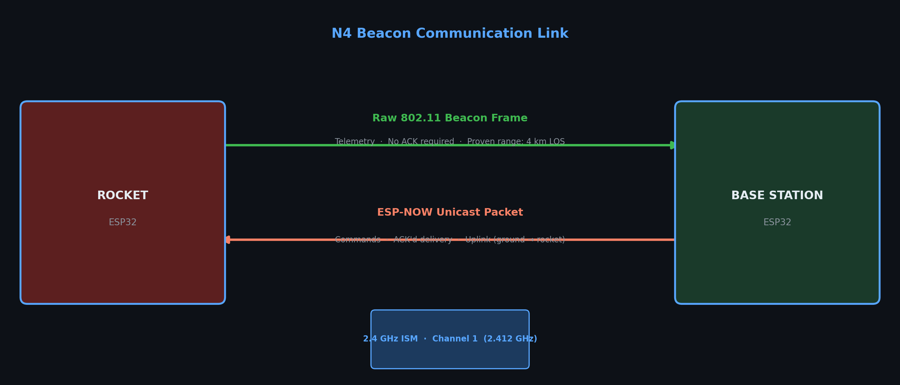

# N4 Beacon Configuration Guide

## What Is the Beacon System?

The N4 beacon system is a **custom long-range telemetry link** built on top of the ESP32's raw 802.11 radio.  
Unlike standard WiFi, the rocket does **not** connect to a network — it injects custom management frames directly into the air, which the ground station captures in promiscuous mode.

Separately, **ESP-NOW** is used for the uplink direction (ground → rocket commands) because it provides confirmed, unicast delivery without needing an access point.



---

## Proven Performance

| Metric | Value |
|--------|-------|
| Tested range | **4 km line-of-sight** |
| Antenna (rocket) | Omni, 2 dBi |
| Antenna (ground) | Directional / Yagi recommended |
| Channel | 1 (2.412 GHz) |
| Frequency band | 2.4 GHz ISM |
| Typical altitude envelope | up to ~3 km AGL |

> **Range is antenna-limited**, not software-limited. With a proper Yagi at the ground station, 10+ km is achievable on ESP32.

---

## Hardware Requirements

### Rocket Side
- ESP32 DevKit (any 38-pin variant)
- External 2.4 GHz antenna connected to the ESP32 antenna port (U.FL or PCB trace)
- Clear RF path — do not shield the antenna inside a metal airframe section

### Ground Station Side
- ESP32 DevKit
- **Directional antenna** strongly recommended for range — a 9 dBi Yagi pointed at the flight path
- USB cable to laptop running the Python telemetry server

---

## Software Architecture

### Transmitter (`src/espnow_beacon_transmitter.cpp`)

The `ESPNowBeaconTransmitter` class handles both directions:

```cpp
ESPNowBeaconTransmitter transmitter(ROCKET_MAC, BASE_MAC);
transmitter.begin();                          // Init WiFi promiscuous + ESP-NOW
transmitter.sendBeacon(&telemetry, size);     // Inject raw frame
transmitter.getNextCommand(&cmdPacket);       // Read received ESP-NOW command
```

**Frame structure** (`buildBeaconFrame`):
1. Standard 802.11 management frame header
2. SSID IE containing a custom magic number
3. Vendor-Specific IE (OUI: `0xAA 0xBB 0xCC`) carrying the CSV telemetry payload
4. Beacon counter field for duplicate detection

Maximum payload: **256 bytes** (`MAX_BEACON_SIZE`).

### Receiver (Base Station)
The base station runs in **promiscuous mode** and filters incoming frames by:
1. Frame type = management, subtype = beacon
2. Vendor IE OUI matches `0xAA 0xBB 0xCC`
3. Source MAC matches `ROCKET_MAC`

When a matching frame is received:
- RSSI is extracted from `pkt->rx_ctrl.rssi` (already in dBm — no conversion needed)
- CSV payload is extracted and forwarded to the Python server via Serial (USB) and Bluetooth

---

## RSSI Interpretation

### How RSSI Is Captured

```cpp
// Inside base station promiscuous callback:
wifi_promiscuous_pkt_t* pkt = (wifi_promiscuous_pkt_t*) buf;
int rssi = pkt->rx_ctrl.rssi;   // Already dBm, negative value
```

### Signal Quality Reference

| RSSI (dBm) | Quality | Typical Distance |
|-----------|---------|-----------------|
| -20 to -30 | Bench / RF coupling | < 1 m (test bench only) |
| -30 to -50 | Excellent | < 100 m |
| -50 to -60 | Good | 100 m – 1 km |
| -60 to -70 | Fair | 1 km – 2 km |
| -70 to -80 | Poor | 2 km – 4 km |
| -80 to -90 | Very poor | Near edge of range |
| < -90 | Packet loss likely | Beyond range |

### RF Coupling Warning

When two ESP32s are within ~30 cm of each other (e.g. bench testing without antennas), the received RSSI will be unrealistically high (-20 dBm or stronger) due to direct RF coupling through board traces. This is **not** a real link measurement.

The base station firmware detects this:
```
[BEACON WARNING] Unusually strong RSSI: -18 dBm (RF coupling?)
```
This warning fires when RSSI > -20 dBm. In flight, RSSI will always be more negative than this threshold.

---

## MAC Address Configuration

The MAC addresses must match between the rocket and base station firmware. Edit `include/defs.h`:

```cpp
static const uint8_t ROCKET_MAC[6] = {0x08, 0xD1, 0xF9, 0x15, 0x9C, 0x04};
static const uint8_t BASE_MAC[6]   = {0x10, 0x06, 0x1c, 0xa6, 0x11, 0xf0};
```

**Read your actual MAC addresses:**
```cpp
#include <WiFi.h>
void setup() {
  Serial.begin(115200);
  WiFi.mode(WIFI_STA);
  Serial.println(WiFi.macAddress());  // Prints AA:BB:CC:DD:EE:FF
}
```

> MAC mismatches are the most common cause of "no packets received" at the base station.

---

## Channel Configuration

Both ends must use **the same WiFi channel**. The default is **channel 1**.

If you need to change the channel:
```cpp
// In begin():
esp_wifi_set_channel(1, WIFI_SECOND_CHAN_NONE);  // Change 1 to desired channel
```

Avoid channels 6 and 11 if operating near other WiFi networks.

---

## Base Station Files

| File | Description |
|------|-------------|
| `base_station_xbee_fixed.cpp` | **Current active base station** — XBee + Bluetooth + Beacon |
| `base_station_with_beacon_rssi.cpp` | Beacon-only with RSSI override |
| `base_station_enhanced_rssi.cpp` | Enhanced RSSI logging variant |
| `beacon-receiver/src/main.cpp` | Standalone beacon receiver project |

---

## Enabling Beacon Mode at Runtime

**Compile-time default** (edit `include/defs.h`):
```cpp
#define MQTT 0   // Start in beacon mode (MQTT disabled)
#define XBEE 0   // XBee also disabled
```

**Runtime switch via serial / MQTT / ESP-NOW**:
```
BEACON_MODE
```

**Verify mode is active**:
```
GET_MODE
```
Expected:
```
[COMM STATUS] Mode: BEACON_ONLY | MQTT: OFF | Beacon: ON | XBee: OFF
```

---

## Range Optimisation Tips

1. **Mount the rocket antenna vertically** along the fuselage axis — the omni radiation pattern is broadside
2. **Point the ground Yagi** along the expected flight trajectory before launch
3. **Elevate the ground antenna** — even 2 m above ground eliminates multipath significantly
4. **Avoid 2.4 GHz congestion** — check for other WiFi networks on channel 1 before flight
5. **Use the directional antenna tracking** — have someone rotate the Yagi to track the rocket
6. **Test RSSI on the pad** before flight — you should see -40 to -55 dBm at 10–50 m range with antennas fitted

---

## Beacon Receiver Sub-Project

A standalone PlatformIO project for a dedicated beacon receiver is in `beacon-receiver/`:

```
beacon-receiver/
├── platformio.ini
└── src/
    └── main.cpp
```

This is useful for a dedicated ground station board without XBee or Bluetooth.  
See `beacon-receiver/README.md` for build instructions.

---

## Testing Without Flight Hardware

1. Flash `beacon-test-station/` firmware to a second ESP32
2. It will transmit synthetic beacon frames at 1 Hz
3. Base station should receive and display RSSI values

See `beacon-test-station/README.md` for the test station quick-start.

---

## Related Documentation

- [COMMUNICATION_ARCHITECTURE.md](COMMUNICATION_ARCHITECTURE.md) — full system overview
- [RSSI_TELEMETRY_INTEGRATION.md](RSSI_TELEMETRY_INTEGRATION.md) — how RSSI flows into telemetry
- [BEACON_RSSI_DEBUG_GUIDE.md](../fixes/BEACON_RSSI_DEBUG_GUIDE.md) — troubleshooting RSSI values
- [BEACON_RSSI_UPDATE_COMPLETE.md](../fixes/BEACON_RSSI_UPDATE_COMPLETE.md) — implementation changelog
