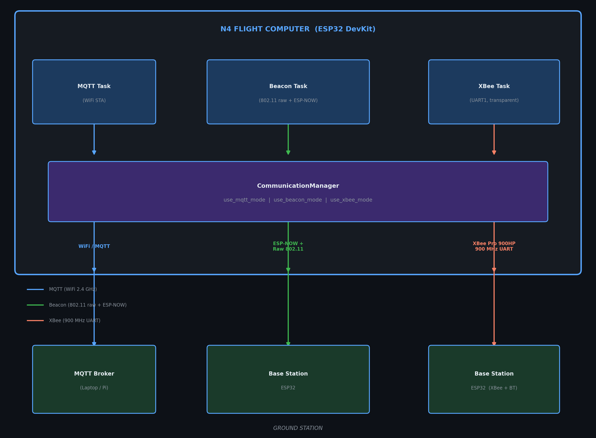

# N4 Communication Architecture

## Overview

The N4 flight computer implements a **hybrid, multi-mode communication system** built on FreeRTOS tasks.  
Three independent physical layers can operate simultaneously or be switched on the fly via runtime commands.



---

## Communication Modes

### Mode 1 — MQTT (WiFi)

| Property | Value |
|----------|-------|
| Protocol | MQTT over TCP/IP |
| Transport | IEEE 802.11 (2.4 GHz) |
| Topic (telemetry) | `n4/flight-computer-1` |
| Topic (commands) | `n4/commands` |
| Default broker port | 1883 |
| Broker IP | Configured dynamically via WiFiManager |
| Effective range | ~100 m LOS (WiFi limited) |

The flight computer connects as a WiFi Station (STA mode). The MQTT broker runs on a laptop or Raspberry Pi at the ground station. Commands are received on the arming topic and dispatched to the CommunicationManager.

**When to use**: Pad operations, pre-flight arming, post-recovery data retrieval within WiFi range.

---

### Mode 2 — Beacon (ESP-NOW + Raw 802.11)

| Property | Value |
|----------|-------|
| Protocol | ESP-NOW + raw 802.11 management frames |
| Transport | IEEE 802.11 (2.4 GHz), channel 1 |
| Max payload | 256 bytes |
| Proven range | 4 km LOS (tested with directional antenna) |
| Rocket MAC | `ROCKET_MAC` in `defs.h` |
| Base MAC | `BASE_MAC` in `defs.h` |

Two mechanisms work together:
- **Telemetry → Ground**: Raw 802.11 beacon frames carrying CSV payload (upward direction, no ACK needed)
- **Commands → Rocket**: ESP-NOW unicast packets from base to rocket MAC (confirmed delivery)

The beacon transmitter is implemented in `src/espnow_beacon_transmitter.cpp` via the `ESPNowBeaconTransmitter` class.  
RSSI is captured from `pkt->rx_ctrl.rssi` inside the promiscuous-mode sniffer callback at the base station.

> **RF coupling warning**: When two ESP32s are side-by-side without antennas, RSSI can read -20 dBm or higher.  
> The base station firmware flags values above -20 dBm as `[BEACON WARNING] Unusually strong RSSI (RF coupling?)`.  
> Real flight RSSI at range will be -50 dBm or lower.

**When to use**: During ascent, apogee, descent — whenever outside WiFi range.

See [BEACON_CONFIGURATION.md](BEACON_CONFIGURATION.md) for antenna selection and range optimisation.

---

### Mode 3 — XBee (900 MHz UART)

| Property | Value |
|----------|-------|
| Hardware | XBee Pro 900HP |
| Frequency | 900 MHz ISM band |
| Mode | Transparent (AP=0) |
| Baud rate | 115200 |
| Flight computer UART | UART1 (TX=32, RX=34) |
| Base station UART | UART2 (TX=32, RX=34) |
| Data format | CSV, newline terminated |

The XBee operates in **transparent mode** — both ends send/receive raw serial bytes. No API framing is used.  
CSV telemetry lines are written directly to `XBeeSerial.println()`.

RSSI for XBee is read from the XBee's PWM/RSSI output pin (GPIO 35 on the base station), which outputs a voltage proportional to signal strength. The base station firmware converts this to dBm.

**When to use**: Long-range flights (1–30 km) where 2.4 GHz beacon has insufficient range.

Full XBee wiring, XCTU configuration and field notes: [XBEE_INTEGRATION.md](XBEE_INTEGRATION.md)

---

### Mode 4 — Bluetooth (Base Station Only)

| Property | Value |
|----------|-------|
| Hardware | HC-05 or HC-06 module |
| Base station UART | UART1 (TX=17, RX=16) |
| Baud rate | 115200 |
| Direction | Base station → laptop/phone only |

Bluetooth is a **base station output channel**, not a flight computer uplink.  
When the base station receives telemetry (via XBee or Beacon), it mirrors the JSON and log messages to the Bluetooth serial port so a tablet or phone can display live data without a USB cable.

---

## UART Assignment Table

### Flight Computer

| UART | Pins | Device | Baud |
|------|------|--------|------|
| UART0 | USB | Debug / console | 115200 |
| UART1 | TX=32, RX=34 | XBee Pro 900HP | 115200 |
| UART2 | TX=17, RX=16 | GPS module | 9600 |

### Base Station (`base_station_xbee_fixed.cpp`)

| UART | Pins | Device | Baud |
|------|------|--------|------|
| UART0 | USB | Debug + Python server | 115200 |
| UART1 | TX=17, RX=16 | Bluetooth (HC-05/06) | 115200 |
| UART2 | TX=32, RX=34 | XBee Pro 900HP | 115200 |

> **Note**: UART1 and UART2 pin assignments differ between flight computer and base station. Always check the source file for the target board.

---

## CommunicationManager

Defined in `include/communication_manager.h` and implemented in `src/communication_manager.cpp`.

### Runtime Flags

```cpp
extern bool use_mqtt_mode;          // Enable MQTT transmission
extern bool use_beacon_mode;        // Enable beacon transmission
extern bool use_xbee_mode;          // Enable XBee transmission
extern bool auto_fallback_enabled;  // Auto-switch MQTT→Beacon on failure
extern bool communication_mode_locked;  // Locked during critical phases
```

### Mode Methods

| Method | Effect |
|--------|--------|
| `setMQTTMode(source)` | MQTT=ON, Beacon=OFF, XBee=OFF |
| `setBeaconMode(source)` | Beacon=ON, MQTT=OFF, XBee=OFF |
| `setXBeeMode(source)` | XBee=ON, MQTT=OFF, Beacon=OFF |
| `setDualMode(source)` | MQTT=ON, Beacon=ON, XBee=OFF |
| `setTripleMode(source)` | MQTT=ON, Beacon=ON, XBee=ON |

### Auto-Fallback Logic

When `auto_fallback_enabled = true`:
1. Every packet checks if MQTT has not succeeded for `MQTT_FAILURE_TIMEOUT` (10 s)
2. After `MQTT_RETRY_ATTEMPTS` (3) failures → automatically switches to Beacon mode
3. MQTT is retried after `AUTO_FALLBACK_HYSTERESIS` (30 s)

---

## Command System

Commands can arrive from any of these sources:

| Source | Mechanism |
|--------|-----------|
| Ground laptop | Serial USB (`handleSerialCommands()`) |
| MQTT broker | Subscribed `n4/commands` topic |
| ESP-NOW | `CommandPacket` from base station ESP32 |
| Bluetooth terminal | Same handler as serial on base station |

All commands are routed through `CommunicationManager::handleModeCommand(command, source)`.

### Available Commands

| Command String | Effect |
|----------------|--------|
| `MQTT_MODE` | Switch to MQTT only |
| `BEACON_MODE` | Switch to Beacon only |
| `XBEE_MODE` | Switch to XBee only |
| `DUAL_MODE` | MQTT + Beacon |
| `TRIPLE_MODE` | MQTT + Beacon + XBee |
| `AUTO_FALLBACK_ON` | Enable auto-fallback |
| `AUTO_FALLBACK_OFF` | Disable auto-fallback |
| `GET_MODE` | Report current mode to serial |
| `ARM` | Arm the flight computer |
| `DISARM` | Disarm the flight computer |
| `RESET` | Software reset |

---

## Telemetry Packet Format

All three modes use the **same 25-field CSV format** for consistency:

```
timestamp,mode,state,ax,ay,az,pitch,roll,gx,gy,gz,lat,lon,gps_alt,gps_time,
pressure,temp,alt_agl,velocity,drogue,main,battery,rssi,kalman_alt,kalman_vel\n
```

| Index | Field | Type | Description |
|-------|-------|------|-------------|
| 0 | `timestamp` | uint32 | ms since boot |
| 1 | `mode` | int | 0=Safe, 1=Armed |
| 2 | `state` | int | Flight state (0–8) |
| 3–5 | `ax,ay,az` | float | Acceleration (m/s²) |
| 6–7 | `pitch,roll` | float | Attitude (degrees) |
| 8–10 | `gx,gy,gz` | float | Gyroscope (rad/s) |
| 11–12 | `lat,lon` | double | GPS coordinates |
| 13 | `gps_altitude` | float | GPS altitude MSL (m) |
| 14 | `gps_time` | uint32 | GPS time HHMMSS |
| 15 | `pressure` | float | Barometric pressure (Pa) |
| 16 | `temperature` | float | Temperature (°C) |
| 17 | `alt_agl` | float | Altitude above ground level (m) |
| 18 | `velocity` | float | Vertical velocity (m/s) |
| 19 | `drogue` | int | Drogue pin state (0/1) |
| 20 | `main` | int | Main chute pin state (0/1) |
| 21 | `battery` | float | Battery voltage (V) |
| 22 | `rssi` | int | Signal strength (dBm); 0 in beacon mode — base station overrides with real value |
| 23 | `kalman_alt` | float | Kalman filtered altitude (m) |
| 24 | `kalman_vel` | float | Kalman filtered vertical velocity (m/s) |

---

## FreeRTOS Task Layout

| Task Name | Core | Priority | Stack | Function |
|-----------|------|----------|-------|----------|
| `mqtt_telemetry` | 1 | 2 | STACK_SIZE×4 | MQTT publish loop |
| `xbee_telemetry` | 1 | 2 | STACK_SIZE×4 | XBee CSV transmit |
| `beacon_transmit` | 1 | 2 | STACK_SIZE×4 | Raw 802.11 beacon |
| `altimeter_task` | 0 | 3 | STACK_SIZE | BMP280 read |
| `gyroscope_task` | 0 | 3 | STACK_SIZE | MPU6050 read |
| `gps_task` | 0 | 2 | STACK_SIZE | UART2 GPS parse |
| `kalman_task` | 0 | 3 | STACK_SIZE | Kalman filter update |
| `state_machine` | 0 | 4 | STACK_SIZE | Flight state transitions |
| `debug_terminal` | 1 | 1 | STACK_SIZE | Serial debug print |

> Disable `debug_terminal` (`DEBUG_TO_TERMINAL 0`) before flight to reduce CPU load.

---

## Mode Selection Recommendations

| Scenario | Recommended Mode |
|----------|-----------------|
| Pad / pre-flight | MQTT (WiFi range) |
| Short-range flight < 2 km | Beacon mode |
| Long-range flight > 2 km | XBee mode |
| Maximum redundancy | TRIPLE_MODE |
| Post-recovery retrieval | MQTT (reconnect WiFi) |
| No WiFi available | XBee mode |

---

## Related Documentation

- [QUICKSTART.md](../QUICKSTART.md) — build and flash guide
- [BEACON_CONFIGURATION.md](BEACON_CONFIGURATION.md) — beacon deep-dive
- [XBEE_INTEGRATION.md](XBEE_INTEGRATION.md) — XBee wiring and XCTU
- [RSSI_TELEMETRY_INTEGRATION.md](RSSI_TELEMETRY_INTEGRATION.md) — RSSI implementation
- [BEACON_RSSI_DEBUG_GUIDE.md](../fixes/BEACON_RSSI_DEBUG_GUIDE.md) — RSSI debugging
- [AUTO_SWITCHING_FIXES.md](../fixes/AUTO_SWITCHING_FIXES.md) — mode switching bug fixes
- [COMMUNICATION_MANAGER_FIX.md](../fixes/COMMUNICATION_MANAGER_FIX.md) — manager fix history
