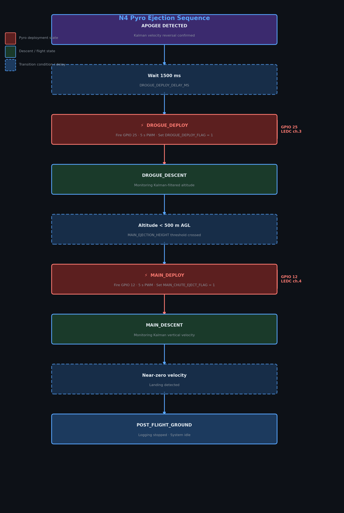

# N4 Pyro Control System

## Overview

The N4 flight computer fires two ejection charges via software-controlled MOSFET outputs:

| Channel | Event | GPIO | PWM Channel |
|---------|-------|------|-------------|
| Drogue | Apogee + delay | 25 | LEDC channel 3 |
| Main chute | Descent to 500 m AGL | 12 | LEDC channel 4 |

Both channels use **PWM (Pulse Width Modulation)** to scale the supply voltage down to a safe ejection level, rather than switching the full supply voltage directly.

---

## Voltage Scaling via PWM

The pyro outputs are driven from a ~15 V LiPo supply, but the ejection charges are specified for 6 V.  
PWM duty cycle is calculated to approximate the target voltage:

```cpp
// From include/defs.h:
#define PYRO_SUPPLY_VOLTAGE     15.0f   // Actual supply (V)
#define PYRO_TARGET_VOLTAGE      6.0f   // Desired ejection voltage (V)
#define PYRO_PWM_FREQ           500     // 500 Hz switching frequency
#define PYRO_PWM_RES_BITS         8     // 8-bit resolution (0–255)
#define DROGUE_PWM_CHANNEL        3     // LEDC channel for drogue
#define MAIN_PWM_CHANNEL          4     // LEDC channel for main
```

**Duty cycle calculation**:

$$\text{duty} = \frac{V_{target}}{V_{supply}} \times (2^{resolution} - 1) = \frac{6}{15} \times 255 = 102$$

The PWM frequency of 500 Hz is intentionally low — MOSFETs switch this easily and the RC time constant of the charge circuit is much longer.

The `include/pwm_voltage_control.h` header provides helper functions to configure and trigger the LEDC channels.

---

## Pin Assignments

Defined in `include/defs.h`:

```cpp
#define DROGUE_PIN           25     // Drogue ejection PWM output
#define MAIN_CHUTE_EJECT_PIN 12     // Main chute ejection PWM output
```

Both pins drive N-channel MOSFETs whose drains are connected to the pyro bridgewire circuit.

---

## Ejection Timing

```cpp
// From include/defs.h:
#define PYRO_CHARGE_TIME              5000   // Drogue: 5 s pulse duration (ms)
#define MAIN_DESCENT_PYRO_CHARGE_TIME 5000   // Main: 5 s pulse duration (ms)

// Deployment delays:
#define DROGUE_DEPLOY_DELAY_MS        1500   // Wait 1.5 s after apogee before firing drogue
```

The drogue channel fires 1.5 seconds after apogee is confirmed. The main channel fires when the Kalman-filtered altitude descends through `MAIN_EJECTION_HEIGHT` (500 m AGL).

---

## Deployment Flags

```cpp
// From include/defs.h:
extern volatile uint8_t DROGUE_DEPLOY_FLAG;     // Set to 1 when drogue fires
extern volatile uint8_t MAIN_CHUTE_EJECT_FLAG;  // Set to 1 when main fires
```

These are `volatile` because they are written by the state machine task and read by the telemetry task. Once set, they are never cleared (one-shot).

---

## Flight State Machine Integration

Defined in `src/states.h` and implemented in `src/states.cpp`:

```cpp
typedef enum {
    PRE_FLIGHT_GROUND = 0,
    POWERED_FLIGHT,        // 1
    COASTING,              // 2
    APOGEE,                // 3
    DROGUE_DEPLOY,         // 4
    DROGUE_DESCENT,        // 5
    MAIN_DEPLOY,           // 6
    MAIN_DESCENT,          // 7
    POST_FLIGHT_GROUND     // 8
} ARMED_FLIGHT_STATE;
```

**State transition logic for ejection**:



---

## Arming Safety System

The flight computer will **not** process ARM commands unless the filtered altitude exceeds `ARM_ALTITUDE_THRESHOLD` (50 m AGL):

```cpp
// From include/defs.h:
#define ARM_ALTITUDE_THRESHOLD  50   // metres AGL required before ARM is accepted
```

This prevents accidental arming on the launch pad.

Physical arming also requires:
- `REMOTE_SWITCH` (GPIO 27) pulled HIGH, or
- `ARM` command received via serial / MQTT / ESP-NOW

The system is **disarmed by default** on boot. With `TEST 0`, telemetry is suppressed while disarmed.

---

## Apogee Detection

Apogee is detected using Kalman-filtered altitude and vertical velocity:

```cpp
// Enabled by default:
#define USE_KALMAN_FOR_STATE_DETECTION  1

// Threshold (raw altimeter):
#define APOGEE_DETECTION_THRESHOLD  3   // metres — velocity must reverse by this amount
```

The Kalman filter (`src/kalman_filter.cpp`) fuses BMP280 barometric altitude with MPU6050 accelerometer data for robust apogee detection, rejecting sensor noise that might otherwise trigger early deployment.

---

## Launch Detection

```cpp
#define LAUNCH_DETECTION_THRESHOLD       10   // metres: altitude must rise by this
#define LAUNCH_DETECTION_ALTITUDE_WINDOW 20   // metres: confirmation window
```

State transitions from `PRE_FLIGHT_GROUND → POWERED_FLIGHT` when both thresholds are met within the window.

---

## Main Chute Ejection Altitude

```cpp
#define MAIN_EJECTION_HEIGHT   500   // metres AGL
#define DROGUE_EJECTION_HEIGHT 1000  // metres AGL (apogee detection target altitude)
```

`DROGUE_EJECTION_HEIGHT` is the reference altitude above which the apogee window is expected. It is not a hard trigger — actual deployment is apogee-triggered, not altitude-triggered.

`MAIN_EJECTION_HEIGHT` is a hard altitude threshold; the main fires when descent through 500 m AGL is detected.

---

## PWM Configuration Commands

The pyro PWM channels can be reconfigured at runtime via serial commands.  
See [PWM_CONFIG_COMMANDS.md](PWM_CONFIG_COMMANDS.md) for the full command set and [PWM_DURATION_UPDATE_SUMMARY.md](../fixes/PWM_DURATION_UPDATE_SUMMARY.md) for recent timing changes.

---

## Pre-Flight Electrical Checks

> ⚠️ **Never install igniter bridgewires while the flight computer is powered.**

| Check | Method |
|-------|--------|
| Continuity (no igniter) | Multimeter across pyro terminals — expect > 1 MΩ with charge installed, shorts indicate fault |
| PWM output voltage | Oscilloscope on GPIO 25/12 — verify ~40% duty cycle at 500 Hz when triggered in test |
| Supply voltage | > 12 V under load required for reliable ignition |
| DROGUE_DEPLOY_FLAG | Verify = 0 on boot (not already deployed) |
| MAIN_CHUTE_EJECT_FLAG | Verify = 0 on boot |

---

## Telemetry Fields for Ejection Status

In the 25-field CSV packet:

| Field | Index | Description |
|-------|-------|-------------|
| `drogue` | 19 | `1` after drogue fires, `0` before |
| `main` | 20 | `1` after main fires, `0` before |

These are the live values of `DROGUE_DEPLOY_FLAG` and `MAIN_CHUTE_EJECT_FLAG`.

---

## Related Documentation

- [QUICKSTART.md](../QUICKSTART.md) — pre-flight checklist
- [COMMUNICATION_ARCHITECTURE.md](COMMUNICATION_ARCHITECTURE.md) — telemetry packet format
- [PWM_CONFIG_COMMANDS.md](PWM_CONFIG_COMMANDS.md) — PWM runtime commands
- [PWM_DURATION_UPDATE_SUMMARY.md](../fixes/PWM_DURATION_UPDATE_SUMMARY.md) — timing update notes
- [LOGGER_IMPROVEMENTS.md](LOGGER_IMPROVEMENTS.md) — ejection event logging
