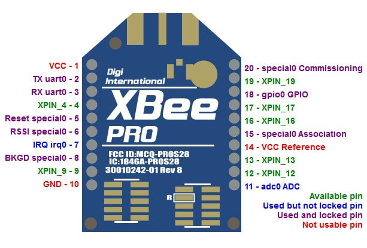
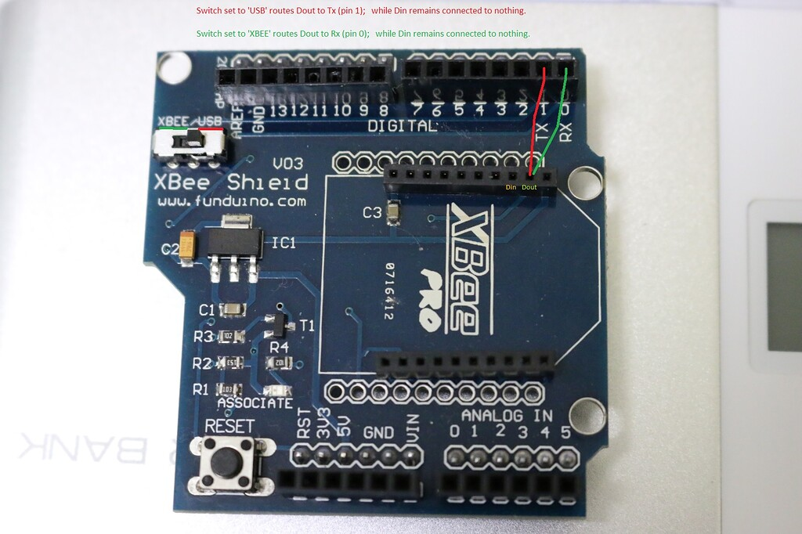

# XBee Communication Integration - N4 Flight Software

## Overview

The N4 flight computer now supports **4 communication modes** with intelligent switching:

1. **MQTT Mode**: WiFi STA + MQTT broker
2. **Beacon Mode**: Raw 802.11 beacons + ESP-NOW commands
3. **XBee Mode**: Direct UART CSV transmission (transparent mode)
4. **Triple Mode**: All three simultaneously

## XBee Configuration

### Hardware Connections

```
ESP32 Pin 34  →  XBee Pin 2 (DOUT)
ESP32 Pin 32  →  XBee Pin 3 (DIN)
ESP32 3.3V    →  XBee Pin 1 (VCC)
ESP32 GND     →  XBee Pin 10 (GND)
```



---

### XBee Shield — USB / XBee Mode Switch

When using an **XBee Arduino Shield**, a physical slide switch on the board selects how the UART is routed:

| Switch Position | UART Routing | When to Use |
|-----------------|--------------|-------------|
| **USB** | Shield UART ↔ USB–Serial adapter | Configuring the XBee in XCTU on a PC |
| **XBEE** (or MICRO) | Shield UART ↔ Host microcontroller | Normal flight operation with ESP32 |

> **⚠️ Critical workflow**: Set switch to **USB** before launching XCTU. After saving all XBee settings, flip the switch back to **XBEE** before connecting to the flight computer — leaving it in USB position will prevent the ESP32 from communicating with the radio.



*The slide switch (highlighted) on the XBee Shield toggles between USB passthrough for XCTU configuration and microcontroller UART for flight operation.*

---

### XCTU Settings (CRITICAL - Must Configure Before Flight)

Configure both XBees (rocket + ground station) with these **exact** settings:

| Parameter | Value | Description |
|-----------|-------|-------------|
| **AP (API Enable)** | `0` | **MOST IMPORTANT** - Enables Transparent Mode |
| **BD (Baud Rate)** | `7` | 115200 baud for high-speed CSV |
| **D1-D4, P2** | `0` | Disable old SPI settings |
| **P3 (DOUT)** | `1` | UART DOUT enabled |
| **P4 (DIN)** | `1` | UART DIN enabled |

> **⚠️ WARNING**: If AP is not set to 0, the XBees will be in API mode and the CSV data will not transmit correctly!

## Configuration in defs.h

```cpp
// Set XBee as default transmission method
#define MQTT 0      // Disable MQTT
#define XBEE 1      // Enable XBee (will create XBee task)
#define TEST 1      // Allow transmission when disarmed for testing

// XBee settings (already configured)
#define XBEE_BAUD_RATE  115200     // High-speed transparent mode
#define XBEE_RX_PIN     34          // ESP32 RX ← XBee DOUT
#define XBEE_TX_PIN     32          // ESP32 TX → XBee DIN
```

## Data Format

### CSV Telemetry String (25 Fields)

Same format as MQTT for consistency:

```
timestamp,mode,state,ax,ay,az,pitch,roll,gx,gy,gz,lat,lon,gps_alt,gps_time,pressure,temp,alt_agl,velocity,drogue,main,battery,rssi,kalman_alt,kalman_vel\n
```

**Example**:
```
1250,1,2,0.15,0.02,9.81,2.5,1.3,0.01,0.02,-0.01,1.234567,36.987654,1450.2,143520,98500.5,25.3,145.2,340.5,0,0,14.8,0,147.3,342.1
```

### Field Breakdown

| Index | Field | Type | Description |
|-------|-------|------|-------------|
| 0 | `record_number` | int | Packet sequence number |
| 1 | `operation_mode` | int | 0=Safe, 1=Armed |
| 2 | `state` | int | Flight state (0-6) |
| 3-5 | `ax,ay,az` | float | Acceleration (m/s²) |
| 6-7 | `pitch,roll` | float | Attitude (degrees) |
| 8-10 | `gx,gy,gz` | float | Gyroscope (rad/s) |
| 11-12 | `latitude,longitude` | float | GPS coordinates |
| 13 | `gps_altitude` | float | GPS altitude (m) |
| 14 | `gps_time` | uint32 | GPS time (HHMMSS) |
| 15 | `pressure` | float | Barometric pressure (Pa) |
| 16 | `temperature` | float | Temperature (°C) |
| 17 | `altitude_agl` | float | Altitude above ground (m) |
| 18 | `velocity` | float | Vertical velocity (m/s) |
| 19 | `drogue_pin_state` | int | Drogue state (0/1) |
| 20 | `main_chute_pin_state` | int | Main chute state (0/1) |
| 21 | `battery_voltage` | float | Battery voltage (V) |
| 22 | `wifi_rssi` | int | RSSI (0 for XBee mode) |
| 23 | `kalman_altitude` | float | Filtered altitude (m) |
| 24 | `kalman_vertical_velocity` | float | Filtered velocity (m/s) |

## Communication Mode Commands

### Switch to XBee Mode

Via ESP-NOW or Serial:
```
CMD_XBEE_MODE
```

This will:
- Disable MQTT transmission
- Disable Beacon transmission
- Enable XBee CSV transmission
- XBee UART is always available (no reconfiguration needed)

### Triple Mode (Maximum Redundancy)

```
CMD_TRIPLE_MODE
```

Transmits via all three methods simultaneously:
- MQTT → WiFi broker
- Beacon → Raw 802.11 frames
- XBee → UART CSV

### Check Current Mode

```
CMD_GET_MODE
```

Response example:
```
[COMM STATUS] Mode: XBEE_ONLY | MQTT: OFF (0ms ago, 0 fails) | Beacon: OFF (0ms ago, 0 fails) | XBee: ON (50ms ago, 0 fails)
```

## Flight Software Integration

### Task Creation

If `XBEE == 1` in defs.h, the system automatically creates:

```cpp
TaskHandle_t XBee_TransmitTelemetryTaskHandle;

// Created in xCreateAllTasks()
xTaskCreatePinnedToCore(XBee_TransmitTelemetry, "xbee_telemetry", STACK_SIZE*4, NULL, 2, &XBee_TransmitTelemetryTaskHandle, 1);
```

### Transmission Control

```cpp
if (comm_manager.isXBeeActive()) {
    if (is_system_armed || TEST) {
        XBeeSerial.println(telemetry_packet_buffer);  // Send CSV + newline
    }
}
```

### Smart Switching Example

```cpp
// Flight computer boots in XBee mode (if XBEE=1 in defs.h)
use_xbee_mode = true;

// On command, switch to MQTT
comm_manager.setMQTTMode("ESP_NOW");

// Auto-fallback: If MQTT fails, switch to Beacon
comm_manager.checkAutoFallback();

// Maximum redundancy for critical phase
comm_manager.setTripleMode("SYSTEM");
```

## Ground Station Receiver

### Example Arduino Receiver

```cpp
#include <HardwareSerial.h>

#define RX_PIN 34
#define TX_PIN 32
#define BAUD_RATE 115200

HardwareSerial XBeeSerial(2);

void setup() {
  Serial.begin(115200);
  XBeeSerial.begin(BAUD_RATE, SERIAL_8N1, RX_PIN, TX_PIN);
  Serial.println("--- N4 Ground Station Listening ---");
}

void loop() {
  if (XBeeSerial.available()) {
    String incomingLine = XBeeSerial.readStringUntil('\n');
    incomingLine.trim();
    
    if (incomingLine.length() > 0) {
      Serial.print("RX: ");
      Serial.println(incomingLine);
      
      // Parse CSV and extract altitude for example
      parseCSV(incomingLine);
    }
  }
}

void parseCSV(String data) {
  // Extract field 17 (altitude_agl)
  int commaCount = 0;
  int startIdx = 0;
  
  for (int i = 0; i < data.length(); i++) {
    if (data[i] == ',') {
      commaCount++;
      if (commaCount == 17) {
        startIdx = i + 1;
      }
      if (commaCount == 18) {
        String altString = data.substring(startIdx, i);
        float altitude = altString.toFloat();
        Serial.printf("Altitude: %.2f m\n", altitude);
        break;
      }
    }
  }
}
```

## Performance Characteristics

### Transmission Rate

- **Default**: 20ms interval (50Hz) - controlled by `CONSUME_TASK_DELAY`
- **CSV size**: ~30 characters average
- **Time to send**: ~2.5ms at 115200 baud
- **Bandwidth headroom**: 17.5ms per cycle

### Range

- **XBee Pro S1**: Up to 1.6 km (1 mile) line of sight
- **XBee Pro 900HP**: Up to 28 km (line of sight) with 915 MHz antennas
- **Antenna (rocket)**: 915 MHz duck antenna
- **Antenna (ground station)**: 915 MHz duck antenna
- Both ends use the same antenna type — no directional tracking required

### Reliability

- **No handshake overhead**: Fire-and-forget transmission
- **No WiFi dependency**: Works anywhere
- **No pairing required**: Simple UART broadcast
- **Error handling**: Built into XBee radio layer (CRC, retries)

## Comparison with Other Modes

| Feature | MQTT | Beacon | XBee |
|---------|------|--------|------|
| **Range** | 100m | 100m | 1600m+ |
| **Setup** | WiFi network | AP mode | Plug-and-play |
| **Latency** | Medium | Low | Very Low |
| **Reliability** | Medium | High | Very High |
| **Infrastructure** | Broker required | None | None |
| **Best Use** | Ground testing | In-flight | Long-range recovery |

## Troubleshooting

### No Data Received

1. **Check XBee configuration**: AP must be 0 (transparent mode)
2. **Verify baud rate**: Both sides must be 115200
3. **Check wiring**: RX/TX must be crossed (ESP32 TX → XBee DIN)
4. **Verify XBEE flag**: Must be 1 in defs.h
5. **Check arming**: System must be armed (or TEST=1)

### Garbled Data

- **Baud rate mismatch**: Reconfigure XBees to 115200
- **API mode enabled**: Set AP=0 in XCTU
- **Multiple devices**: Ensure only one transmitter per channel

### Task Not Created

```
[-]XBee transmit task failed to create
```

**Solution**: Check `XBEE` flag in defs.h and verify heap memory:
```cpp
Serial.println(esp_get_free_heap_size());
```

### XBee Won't Transmit

1. Check `comm_manager.isXBeeActive()` returns true
2. Verify `is_system_armed == true` or `TEST == 1`
3. Monitor serial output for `[XBEE TX]` messages

## Testing Procedure

### 1. Bench Test (No Flight)

```cpp
#define XBEE 1
#define TEST 1  // Allow transmission when disarmed
```

Upload to flight computer, connect XBee, open ground station serial monitor.


*Successful first transmission: raw CSV telemetry appearing in the ground station serial monitor confirming end-to-end radio link.*

### 2. Command Test

Send via ESP-NOW or Serial:
```
CMD_XBEE_MODE
CMD_ARM
```

Should see:
```
[COMM MANAGER] Switched to XBee-only mode
[XBEE TX] 1,0,0,0.01,0.02,9.81,...
```


*Live packet stream in XCTU or serial monitor: each line is one 25-field CSV telemetry frame.*

### 3. Range Test

Walk away from ground station with flight computer powered. Monitor signal quality and packet loss.

### 4. Flight Test

```cpp
#define XBEE 1
#define TEST 0  // Require arming
```

Arm via command, launch, monitor telemetry throughout flight.

## Best Practices

### Pre-Flight Checklist

- [ ] XBees configured in XCTU (AP=0, BD=7)
- [ ] Wiring verified (continuity test)
- [ ] 915 MHz duck antenna securely connected on both rocket and ground station XBees
- [ ] Serial monitor open and receiving test data
- [ ] Battery voltage sufficient (>11V for reliable transmission)

### Recommended Configuration

**For maximum reliability during flight:**

```cpp
#define MQTT 0           // Disable WiFi (interferes with beacon)
#define XBEE 1           // Primary long-range link
#define TEST 0           // Require arming
```

**Then use beacon for short-range backup:**
```
CMD_DUAL_MODE  // XBee (primary) + Beacon (backup)
```

### Post-Flight Analysis

Ground station logs can be directly imported into Excel/MATLAB for analysis since data is in CSV format.

## Summary

XBee integration provides:

✅ **Simplest setup**: Plug-and-play UART communication  
✅ **Longest range**: Up to 3.2km with Pro models  
✅ **Lowest latency**: No protocol overhead  
✅ **Highest reliability**: Hardware-level error correction  
✅ **CSV format**: Human-readable, Excel-compatible  
✅ **Smart switching**: Seamless mode transitions  

The N4 flight computer now has a robust, multi-redundant communication architecture suitable for high-altitude flights with automatic fallback and mission-critical data logging.
